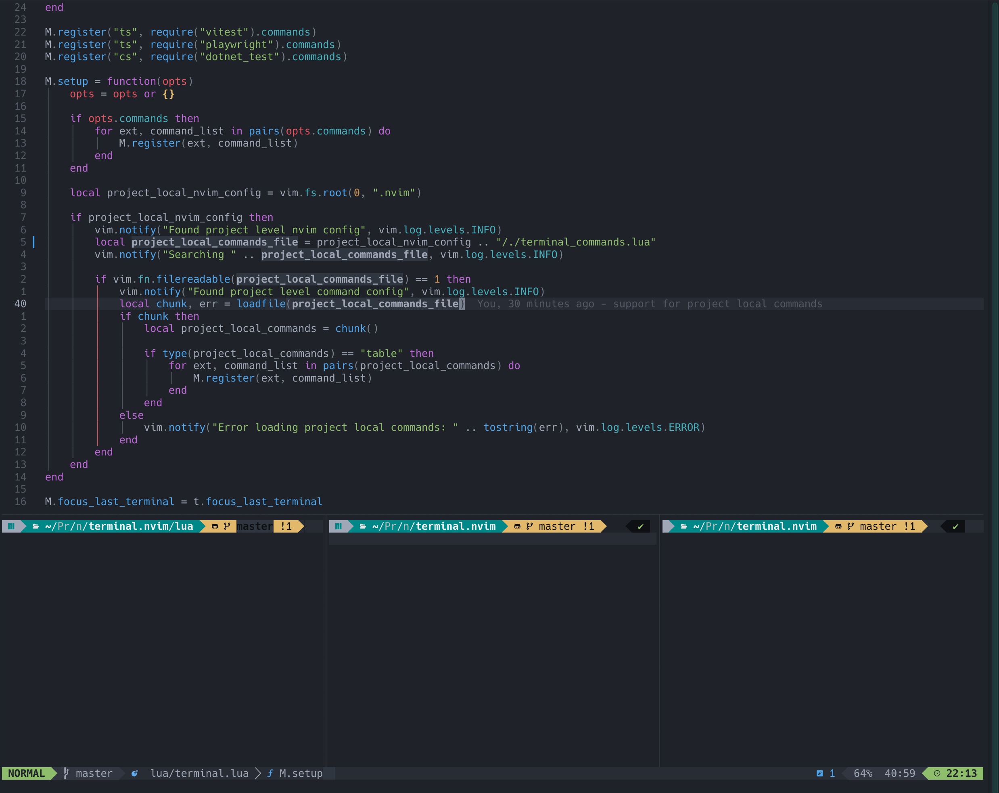

# terminal.nvim

Opening terminals in a predefined order / position based on my personal preference.

## focus_last_terminal

Focuses the rightmost terminal. If no terminal exists it opens a new one in a bottom split. The terminal will be automatically set to insert mode.

## open_new_terminal

Opens a new terminal to the right of the last one. If no terminal exists it opens one in a bottom split.

The working directory is determined by the currently open file. If no file is open or the current buffer is a terminal the terminal will be opened in the current working directory.

A custom directory can be passed as argument.
