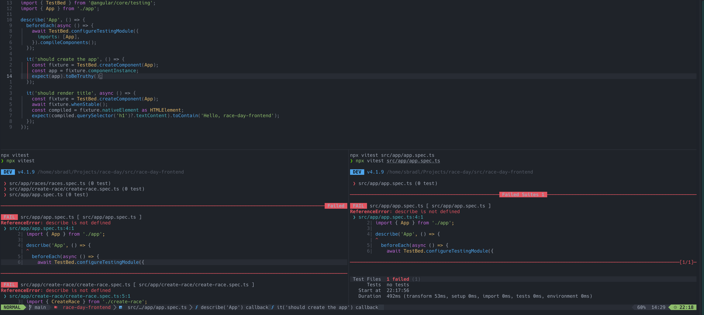

# terminal.nvim

Opening terminals in a predefined layout and execute custom commands.


## Functions

### focus_last_terminal

Focuses the rightmost terminal. If no terminal exists it opens a new one in a bottom split. The terminal will be automatically set to insert mode.

### open_new_terminal

Opens a new terminal to the right of the last one. If no terminal exists it opens one in a bottom split.

The working directory is determined by the currently open file. If no file is open or the current buffer is a terminal the terminal will be opened in the current working directory.

A custom directory can be passed as argument.

### run_command

Based on the current file a selection of commands is displayed.


The selected command will be executed in a new terminal.


Commands can be specified in a file ```terminal_commands.lua``` insider a ```.nvim``` directory. The file must return a table. The keys are the extensions of the files for which commands should be specified.
Every command needs a ```label``` which is displayed in the user selection.
The ```cmd``` is a function which returns a table with the ```dir``` where the command should be executed and a ```command_line``` string for the actual command.
Optionally a ```filter``` function can be specified to further narrow down for which files the command should be offered.

An example for running playwright tests could look like this:

```
local function get_project_dir(filename)
 return vim.fs.root(filename, { "playwright.config.ts" })
end

return {
 ts = {
  {
   label = "Playwright",
   filter = function(filename)
    return get_project_dir(filename) ~= nil
   end,
   cmd = function(filename)
    local project_dir = get_project_dir(filename)

    return {
     dir = project_dir,
     command_line = "npx playwright test",
    }
   end,
  },
 },
}
```

The ```filter``` looks for a playwright.config.ts file above the current file's directory. If it exists the Playwright command will be available.
